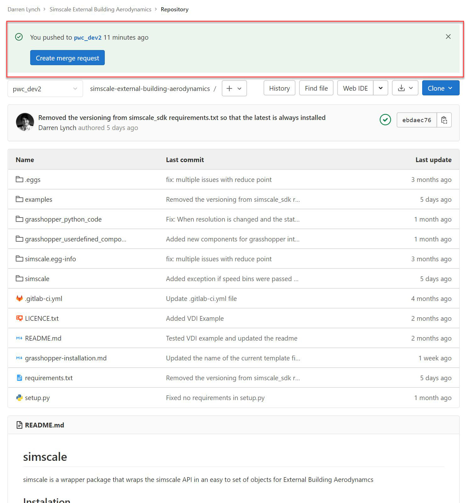
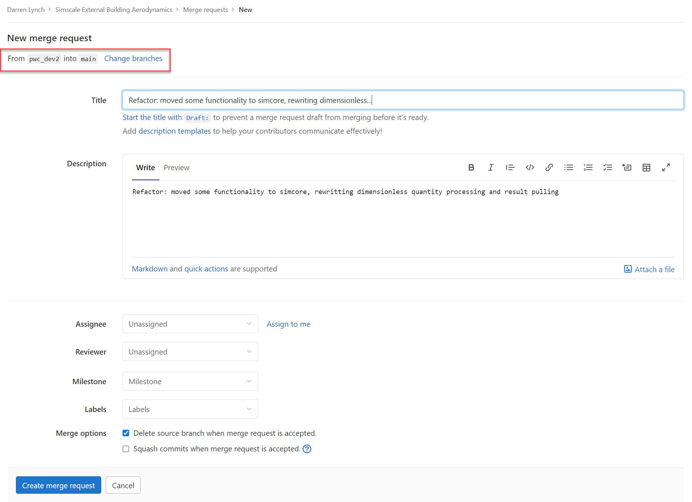

# Contributing

In git bash change directory to where you wish to work from, replacing <location> with a directory:

    cd "C:\<location>"

Clone the repository to the location, replacing <branch-name> with a branch:

    git clone --branch <branch-name> https://gitlab.com/mdeiri/external-building-aerodynamics-validations.git

alternatively you could remove --branch <branch-name> for the main repo

Change the directory to the newly cloned repository

    cd "C:\<location>\external-building-aerodynamics"

Check out a new branch, with name <new-branch>:

    git checkout -b <new-branch>

Commit the new branch:

    git push origin <new-branch>

Do the development work you need to do, this might be new code or just documentation changes

You can commit these changes in intervals or at the end using the following, 
remember **NEVER** commit to a branch that is not yours. The <description> should 
be descriptive of the work you have done.

    git add .
    git commit -m "<description>"
    git push origin <new-branch>

A message like this should appear:

    remote:
    remote: To create a merge request for pwc_dev2, visit:
    remote:   https://gitlab.com/mdeiri/external-building-aerodynamics-validations.git/pull/new/pwc_dev2
    remote:
    To https://github.com/SimScaleGmbH/external-building-aerodynamics.git
     * [new branch]      <new-branch> -> <new-branch>

Finally, when you have finished you can create a merge request, this tells me
that you have finished developing, you have tested that what you have developed
works and doesn't effect current functionality, and you wish to merge the development
with a current branch. 

I consider the main production branch to be main
I consider the main development branch to be pwc_dev1

You should merge to **pwc_dev1**.

Navigate to:

    https://github.com/SimScaleGmbH/external-building-aerodynamics/pull/new/pwc_dev2

There is a button that says create merge request, click it:

You will then be taken into a New merge request form. Important! change branches to merge with pwc_dev1:

Once this says <new-branch> into pwc_dev1, continue to fill in the title and 
description if left blank or doesn't describe what has been developed we will not
be able to merge it. The assignee and reviewer should be 'Darren Lynch' or '@DHLnch1'.

Once done filling in, click 'Create merge request'

That's it, once merge request has been accepted, you will get an email. 