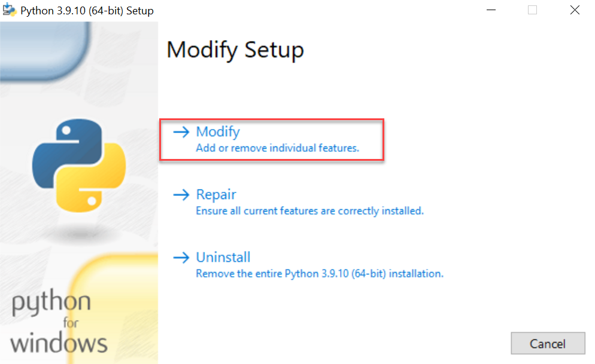
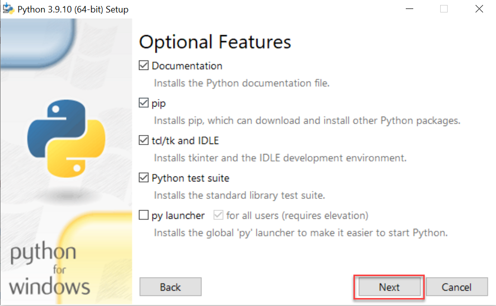
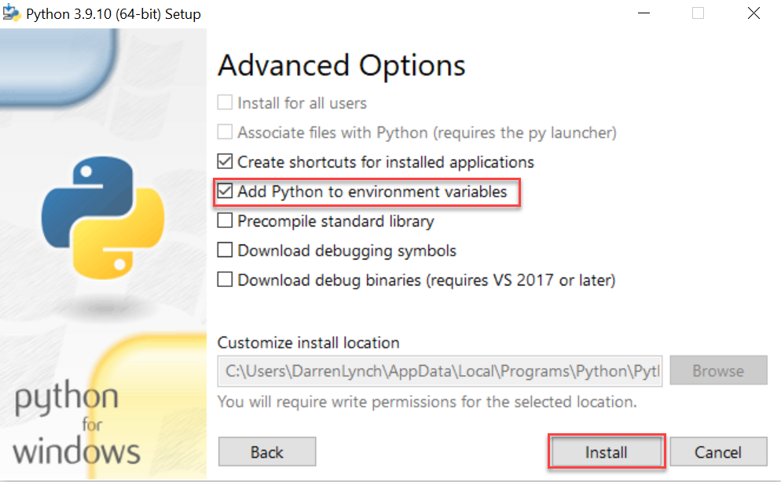
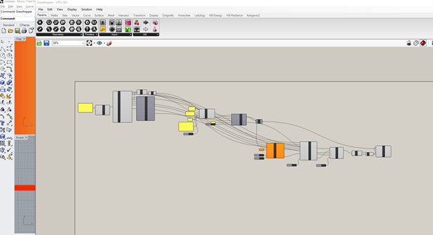
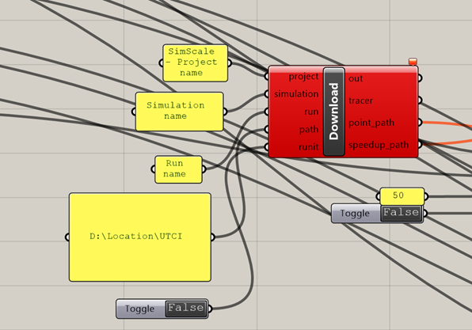
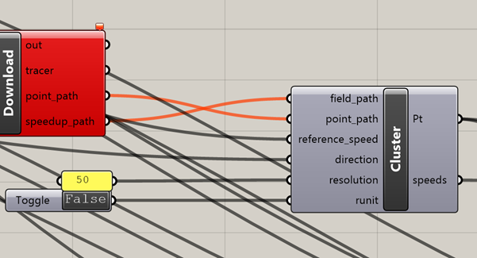
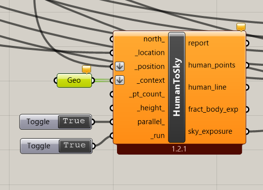

# Guide to setup the environment for UTCI calculation

Note that the following setup is for **Windows OS**

## Requirements

The following are the overall requirements. Those topics will be discussed in depth in this document

 1. A professional SimScale Account with **Pedestrian Wind Comfort** (PWC) simulation capability
 2. API access, with a valid **API Key**
 3. A SimScale project with PWC results
 4. Administration privileges on your local PC for installation
 5. Python > v3.6
 6. SimScale External Building Aerodynamics module (https://github.com/SimScaleGmbH/external-building-aerodynamics)
 7. Rhino > 6.0 + Grasshopper Plugin for Rhino (comes default with Rhino > 6.0)
 8. Ladybug > v1.2.0

# Step-by-Step

- You need to be logged in as administrator of your computer during the following installation. Some of these write a path file which will be directly called from the command line, and this is possible only when you are logged in as the administrator.

## Install Python 3.6 or later

- [Get latest Python3 release](https://www.python.org/downloads/windows/) and install.

### Following steps are needed for later versions, we noticed this after around Python 3.8

- Go back to the installer, and start the application
- Once loaded, choose to modify the installation

- On the **Optional Features** panel leave as is and select **next**

- On the **Advanced Options** panel, check **Add Python to environment variables**


## SimScale API - [Reference](https://github.com/SimScaleGmbH/simscale-python-sdk)

To allow grasshopper to 'talk' to SimScale we need to give it permission. Much like you are expected to log in using a user name and password in SimScale, the SimScale API asks for a **URL** and a **Key**. We can set this in two ways, via a yaml file in your home directory (easiest) or by setting environment variables on your PC (recommended).

### Method 1, YAML file (Easiest)

 - In the CMD window, type the command:
	 `echo %HOME%`
	The reply will probably be something like 
	`c:\Users\<your user name>`
 - Copy the file from [here](https://github.com/SimScaleGmbH/external-building-aerodynamics/tree/master/key_file) and place it in the directory echoed in the above step.
 - Open the file in a text editor and replace the key so it is your key, that was sent to you. 
```
prod_api_keys:
	SIMSCALE_API_URL: "https://api.simscale.com"
	SIMSCALE_API_KEY: "Your API Key"
```
 - Save and close the file

### Method 2, Environment Variables (Recommended)

- Set the environment variables: Search for **Advanced System Settings** from your Windows menu > Environmental Variables > Add new User Variables as follows. Note: You will receive the API key in a separate mail

	| Variable Name | Variable Value |
	|--|--|
	| SIMSCALE_API_KEY | Your API Key |
	| SIMSCALE_API_URL | https://api.simscale.com |

 - you can test you variable by typing the following command into a **new** command line terminal, it should return your api key.
    `echo %SIMSCALE_API_KEY%`
    If it instead returns `%SIMSCALE_API_KEY%` you should revisit this step.

## SimScale External Building Aerodynamics module - [GitHub reference](https://github.com/SimScaleGmbH/external-building-aerodynamics)

 - Install some git client, e.g. [https://desktop.github.com/](https://desktop.github.com/)
 - To install the main module, type the following commands in the **CMD** window.

```bash
pip install GitPython wheel
pip install git+https://github.com/SimScaleGmbH/external-building-aerodynamics.git
```

- You can test the installation by typing `simscale-eba --help` into the **CMD** window, you should see a response similar to the following:
```
Usage: simscale-eba [OPTIONS] COMMAND [ARGS]...

Options:
  --help  Show this message and exit.

Commands:
  cast-ordinate
  cast-speed
  download-pwc-results
  get-direction
  set-api-variables
```


## Ladybug

- Download and install Ladybug from [here](https://www.food4rhino.com/en/app/ladybug-tools)
- You can refer [here](https://github.com/ladybug-tools/lbt-grasshopper/wiki/1.1-Windows-Installation-Steps) for the installation guide.

## Getting Started

 - [Here](https://github.com/SimScaleGmbH/external-building-aerodynamics/tree/master/examples/Grasshopper%20Example) are some example files, try the simple_result_vis.gh to begin with, this will simply visualise wind speed in rhino.
 - You can open the buildings.3dm model in rhino
 - Open the simple_result_vis.gh in grasshopper
 - Copy [this](https://www.simscale.com/projects/dlynch/thermal_comfort_test_2/) project into your dashboard
 - In the Download component:
	 - Change the project name to what you renamed the project with
	 - Change the Simulation name if needed, UK for example.
	 - Change the Run name if required, 16 direction for example
	 - Put a path to somewhere in your computer  you can download results to, we recommend making a new directory for each project. 
	 - Toggle the **Boolean toggles** to **true**

## Computing UTCI and extracting results

1. Open Rhino
2. In the **Command** line (above the toolbar) type **Grasshopper** (GH) to open the plugin.
3. Open the GH file that was prepared by Darren (SimScale) **simple_humantosky_utci.gh**. You can find this file in the repo [Here](https://github.com/SimScaleGmbH/external-building-aerodynamics/tree/master/examples/Grasshopper%20Example)



4. The Panels marked in **yellow** are the ones where modification is required. For instance the first panel is the one where the weather file needs to be imported. You can select the file directly from the website like [here](http://climate.onebuilding.org/WMO_Region_2_Asia/SAU_Saudi_Arabia/index.html). Simply right click on the desired zip file and select &#39;copy link address&#39;.
**Note** : In the beginning, make sure to Toggle all booleans to be _ **False.** _ Once you complete the steps (for instance, wind information), then toggle the booleans one-by-one.
5. The next Panels are to define the wind data. As you see below, the first panel is to enter the project name. Make sure to key in the _exact name_ as in your SimScale project.
 The second panel is the simulation name exactly as in the project (for instance &#39;Pedestrian Wind Comfort&#39;)&#39;. The third panel is the run name (&#39;for example &#39;Run 1&#39;).
 The last panel is the location in your local machine where intermediate results will be stored.
 


6. The next manual entry is the resolution. For the first trial, have a very coarse resolution like 50 (equivalent of 50 m). Once we have the initial trial, then for the final version it is advisable to have resolution like 5m.



7. The last manual entry is to obtain the geometry. In order to do this, select the main Rhino window and open the CAD file. You can now go back to the GH environment, right click on the **Geo** field and select one or multiple files.



9. Once all of the computation is done, you can navigate to the last field &quot;Heatmap&quot;. Right click on the Heatmap and select **Preview**. This will display the UTCI plot along with the file inside Rhino.